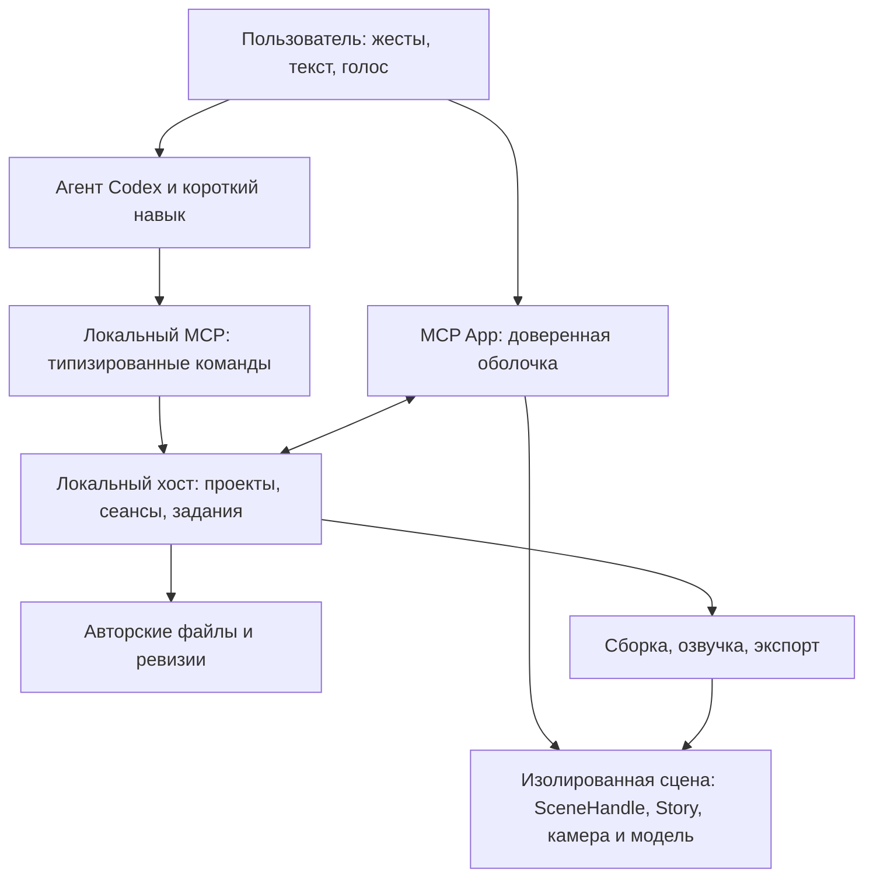

# Visual Storytelling Codex Plugin — технический дизайн

Статус: проект решения для реализации. Дата: 4 октября 2026. TDD здесь означает Technical Design Document.

Основание: обсуждение с Амиром, чтение владельцев кода и официальных контрактов платформы, независимая проверка дизайна. Срез — `main`, `3386e25`, core 0.9.0, включая MorphStory и CharacterStory. Плагин и его нативная интеграция предстоят реализации. Ссылки на платформу проверены 4 октября 2026; её неизвестные свойства проверяются первым срезом S0.

## 1. Продукт и границы первого выпуска

Visual Storytelling превращает разговор в живое, редактируемое визуальное объяснение. Пользователь может смотреть рассказ, исследовать механизм, обсуждать конкретный объект с агентом, менять условия, создавать ответвления объяснения и выпускать результат как интерактив, видео или исходный проект.

Первичная аудитория — люди, которые учатся сами, объясняют коллегам или готовят учебные материалы. Формат определяется вопросом, аудиторией и местом использования. Аккуратная рисованная экспликация остаётся сильным вариантом для обучения; продуктовая инструкция сохраняет узнаваемость продукта. Сетка, 3D, голос, музыка и субтитры включаются по смыслу.

Целевая первая среда — Codex desktop на macOS Apple Silicon. Поддержка других desktop-платформ расширяется после самостоятельной проверки установки и полного авторского пути на каждой из них. Готовый автономный интерактив сохраняет браузерную переносимость независимо от доступности авторских инструментов на устройстве зрителя.

Основное выполнение локальное. Собственный аккаунт и сервер вычислений не требуются. Установка зависимостей может требовать сети; готовый автономный интерактив работает офлайн. Sites, облачный рендеринг, совместное сетевое редактирование и платежи отложены до конкретной потребности. Возможность публичного распространения проверяется отдельно, до заявления о доступности всем пользователям.

## 2. Что уже существует и что предстоит достроить

| Область | Проверенный владелец в текущем коде | Доработка для продукта |
| --- | --- | --- |
| Сцена и жизненный цикл | [`src/scene.ts`](../src/scene.ts), [`SceneHandle`](../src/scene-handle.ts), `root.scene` | Типизированные возможности, наблюдение и восстановление сеанса; убрать необходимость раскрывать внутренности через `Object.assign(root.scene, …)` |
| Время, речь и исследование | [`story.ts`](../src/story/story.ts), [`transport.ts`](../src/story/transport.ts), [`media.ts`](../src/story/media.ts) | Сохранить один медиатранспорт; добавить общий rate и полный снимок сеанса. Сейчас произвольный `snapshot()` возвращает вычисленную модель, а не весь опыт пользователя |
| Объекты и метки | [`cues.ts`](../src/story/cues.ts), [`object.ts`](../src/ink/object.ts), [`inspection.ts`](../src/viewport/inspection.ts) | Общая семантическая адресация, поиск, выбор и связь с исходником. Текущие индексы дочерних 3D-объектов не подходят как долговечные пользовательские ссылки |
| Камера, письмо и морфинг | `src/viewport/`, `src/ink/`, `src/morph/`, `src/physics/` | Использовать существующие реализации; общий контракт capture/restore и выбора объекта должен охватить SVG и 3D |
| Авторство математического рассказа | [`MorphStory`](../src/morph/story.ts), [`MathPart / MathMorphFrame`](../src/morph/types.ts), [`gradient-descent`](../examples/gradient-descent/scene.js) | Уже есть главы, параметры, ручной прогресс и происхождение вкладов; связать их с общим сеансом и предметным inspect |
| История и сохранение | [`SceneHistory`](../src/controls/history.ts), [`widgetState`](../src/host/widget-state.ts) | Сохранить группировку жестов, заменить прямую зависимость от `window.openai` адаптером хоста; добавить ревизии файлов. Офлайн-сохранение остаётся нужной возможностью |
| Создание и обнаружение API | [`scene.mjs`](../tools/scene.mjs), [`catalog.mjs`](../tools/catalog.mjs), [`api.mjs`](../tools/api.mjs), [`scene-project.mjs`](../tools/scene-project.mjs) | `new`/`examples` сейчас зависят от авторского репозитория; вынести их операции из CLI и поставлять согласованный авторский комплект |
| Подготовка и выпуск | [`deliver.mjs`](../tools/deliver.mjs), [`video-export.mjs`](../tools/video-export.mjs), [`standalone.mjs`](../tools/standalone.mjs), [`build-output.mjs`](../tools/build-output.mjs) | Сохранить готовые экспорт, сжатие и публикацию результата; добавить структурированные события, фоновые задания и выполнение из неизменяемого входного снимка |
| Горячее обновление | [`dev.mjs`](../tools/dev.mjs) | Сейчас перезагрузка восстанавливает числовое время. Нужен переход между согласованными версиями с сохранением смыслового места, камеры и исследования |
| Озвучка и тихое авторство | [`tools/audio/`](../tools/audio/), [`narration.mjs`](../tools/narration.mjs) | Существующий кэш и выравнивание обернуть в контракт провайдера; разделить проверку, установку и синтез. Текущий `--silent` вызывает Python и удаляет `narration.json`; для переключаемого голоса нужен тихий режим с сохранением сценария |
| Проверка результата | [`open-scene.mjs`](../tools/open-scene.mjs), [`tools/motion/`](../tools/motion/), [`check-delivery.mjs`](../tools/check-delivery.mjs) | Расширить на нативные поверхности Codex и полный путь внешнего автора; переиспользовать существующий захват и диагностику |
| Навык и примеры | [`skill/SKILL.md`](../skill/SKILL.md), [`examples/catalog.json`](../examples/catalog.json) | Убрать зависимость от личного симлинка и другого плагина для inline-показа; справка, примеры и API должны соответствовать установленной версии |

[`CharacterStory`](../src/characters/story.ts) добавляет cast/props/beat IDs, собственный snapshot и сохранение времени через widgetState. Его подключение должно использовать те же сеанс, выбор и историю; права на Spine/Chibi определяют доступность этой части в публичном комплекте (§11). Субтитры, действия интерфейса, видеокадр, параллельный MP4 и компактный HTML уже имеют владельцев и сохраняются при упаковке.

## 3. Пользовательский опыт

### Первое объяснение

После установки человек пишет обычный запрос. Агент использует контекст и показывает в чате законченный смысловой фрагмент: вопрос, видимое действие и понятный результат. Длинное объяснение может наращиваться последующими главами; новая глава публикуется целиком. Незавершённая генерация не подменяет рабочий материал.

Без настроенного голоса используется полноценный тихий рассказ с авторскими паузами и смысловыми подписями. Сценарий и cue IDs сохраняются для последующего включения речи. Выбор озвучки показывает доступные источники и необходимую загрузку. Подготовка экспорта возникает при его запросе. Предпочтения сохраняются; уже разрешённая настройка не превращается в повторный опрос. Прерванная загрузка имеет повтор и путь «Продолжить без голоса»; отсутствие сети не мешает установленным примерам и готовым работам.

### Одна работа на разных поверхностях

| Поверхность | Содержание и поведение |
| --- | --- |
| Внутри сообщения | Работающий интерактив, текущая глава, компактный плеер, разворачивание и контекстное обсуждение |
| Панель разговора / развёрнутый вид | Та же работа с достаточным пространством для исследования, параметров, правки и демонстрации |
| Боковой раздел плагина | Недавние локальные проекты, примеры и продолжение незавершённого занятия; просмотр библиотечных примеров сам по себе не создаёт проект |
| Самостоятельный HTML | Тот же renderer и предметная модель; локальные управление и исследование работают без Codex |

Раскрытие inline-представления сохраняет `sessionId`, место рассказа, параметры, выделение и камеру. Другой разговор открывает собственный сеанс того же проекта: его ручные действия не перематывают занятие первого пользователя/разговора. Сохранённые авторские изменения распространяются через версии документа.

Рабочее представление следует принятой версии проекта и обновляется на месте. Сообщение фиксирует, какая ревизия была показана; ссылка на конкретный момент содержит эту ревизию. Повторное открытие предлагает продолжить текущую работу, а явно сохранённый выпуск открывается закреплённым. Плагин не хранит бессрочную копию каждой промежуточной сборки: для удалённой ревизии сообщает об этом, сохраняя доступ к исходнику и текущей версии.

### Управление без борьбы за внимание

Название текущей главы служит заголовком и открывает навигацию по главам. Пуск, перемотка, позиция и звук находятся на одной линии. Дополнительные параметры показываются там, где пользователь действительно может что-то исследовать. В небольшом встроенном примере интерфейс экономит место, сохраняя читаемые подписи и доступное управление.

В пространственных сценах вращение продолжает рассказ; средняя кнопка перемещает камеру как Shift + левая. Повторное нажатие «Рассказ» плавно возвращает текущий сценарный ракурс, «Исследовать» — исходный исследовательский. Отдельная кнопка возврата не требуется. Пуск/пауза не сбрасывают ручной ракурс. Жест отменяет автоматическое движение только затронутой камеры.

Смена предметного параметра приостанавливает записанный рассказ и показывает эксперимент из текущего состояния. Это сохраняет соответствие речи исходному материалу. Пользователь может вернуть условие, сохранить вариант или попросить объяснить новое следствие. «Продолжить рассказ» восстанавливает авторские параметры в сохранённой смысловой точке.

### Обсуждение и преподавание

Выбор объекта даёт контекст, действие «Обсудить» приостанавливает запись и прикрепляет к вопросу `discussionAnchor`: показанную ревизию, момент, предметы, временные параметры и наблюдённые значения. При необходимости добавляется кадр. Пользователь видит вложение до отправки; дальнейшее исследование сохраняет смысл исходного вопроса. Дополнительный пример использует обычную сцену и закладку возврата; созданный материал сохраняется как черновик, а включение его в основной рассказ — авторская правка.

Голосовой разговор Codex использует те же команды, что и текстовый. Фразы «вернись к умножению», «а если число отрицательное», «покажи медленнее», «сохрани этот вариант» адресуют конкретное состояние. Для самостоятельного обучения агент предлагает прогноз перед раскрытием результата; для демонстрации аудитории выбирает связное изложение. Это авторский выбор, а не обязательный опрос на каждом шаге.

Плагин не предполагает доступ к началу каждой голосовой реплики Codex. До подтверждения такого события согласование звука обеспечивается явным входом в обсуждение или командой паузы. Синхронный записанный фильм и живой разговор имеют разные источники времени.

## 4. Архитектура и владельцы



Один локальный процесс обслуживает необходимые операции; границы ниже описывают ответственность:

- **ProjectStore** хранит зарегистрированные проекты, ревизии авторских файлов и историю принятых правок. Он не знает покадровую геометрию.
- **SessionDirectory** маршрутизирует команды в активное представление и хранит последнюю подтверждённую контрольную точку. Текущим просмотром владеет runtime сцены.
- **JobRunner** выполняет подготовку и выпуск через существующие операции `tools/`. Он владеет очередью, прогрессом, отменой и результатами, без повторной реализации экспорта или TTS.

Публичной границей остаётся расширенный `SceneHandle` на `root.scene`. Внутренний `SceneSession` связывает Story, камеру, выбор и историю, собирая снимок из их состояний; второй store параметров или часов не создаётся. В рассказе время принадлежит `transport`, вычисление — `stateAt → derive → render`. Симуляция сохраняет `SimulationPlayer`/`PhysicsPlayer`; перемотка объявляется только при корректном replay/checkpoint. `SceneShell` и MCP вызывают одинаковые операции. Возможности статичной сцены, рассказа и симуляции различаются явно.

CLI продолжает работать самостоятельно. Создание, подготовка и выпуск получают программный вход, `AbortSignal`, прогресс и результат; CLI и MCP только адаптируют их. Node–Python/FFmpeg остаётся необходимой процессной границей с машинным протоколом. Разбор человеческих логов и запуск собственной CLI из MCP заменяются прямыми вызовами владельцев.

### Структура исходников

Сохраняются `src/`, `tools/`, `examples/`, `docs/`. Новые домены появляются по мере соответствующего среза:

```text
src/scene-handle.ts           # существующая публичная граница сцены
src/session/                 # связывание владельцев, команды, смысловые объекты и снимки
tools/                      # общие операции авторства, озвучки, проверки и выпуска
plugin/project/             # файловые ревизии и транзакции
plugin/session/             # маршрутизация, подключённые представления, право исполнения
plugin/jobs/                # жизненный цикл длительных операций
plugin/mcp/                 # схемы, инструменты, ресурсы; тонкий протокольный адаптер
plugin/ui/                  # подключение Codex и навигация по проектам
plugin/package/             # воспроизводимая сборка устанавливаемого комплекта
skills/visual-explainer/     # единственный исходник навыка после переноса skill/
plugin.json                 # канонический portable manifest
mcp.json                    # конфигурация одного MCP-сервера
```

Каталоги выделяются по мере роста конкретного владельца; отдельная папка для каждого интерфейса не нужна. SDK Codex/MCP импортируется на границе `plugin/`. Математика, renderer и автономная сцена остаются независимыми от хоста.

## 5. Документ, сеанс и транзакции

### Авторский проект

Проект остаётся редактируемой директорией: исходник сцены, предметные данные, сценарий, ресурсы и закреплённые зависимости. Небольшой `story.vstory` содержит ID, версию формата, название и относительную точку входа. Он служит входом в проект. Граф объектов и предметные вычисления остаются в коде; второго декларативного языка сцены не вводится.

`sourceRevision` — хеш входного manifest проекта: исходники, сценарий, транзитивные ассеты, lockfile и content IDs закреплённых зависимостей. `buildRevision` — идентичность готового комплекта renderer + timeline + media и инструментов. [`build-info.mjs`](../tools/build-info.mjs) уже даёт hashes/receipts библиотеки; manifest сцены добавляет ProjectStore. Его обход явно включает нужные файлы конфигурации и проверяет symlink внутри разрешённого проекта; текущий обход библиотеки пропускает dotfiles/symlink. Неизменяемые зависимости используются по content ID, без копирования всего toolchain при каждой реплике. Справка API разрешается из зависимости проекта.

Авторские файлы, принятые ресурсы и выпуски находятся вне кэша установки плагина и сохраняются после его удаления. Индексы и промежуточные сборки восстанавливаемы. Кэш ограничен; сборки активных сеансов и закреплённого обсуждения, действующая история отмены и сохранённые выпуски защищены. Новый путь перенесённого проекта привязывается после проверки manifest; повторное открытие той же директории не создаёт дубликат. Копирование проекта как нового выдаёт новый ID.

### Сеанс просмотра

Сеанс содержит `projectId`, `sessionId`, показанную ревизию, смысловое место `{chapterId, cueId, progress, time}`, состояние транспорта, ракурс, выбранные объекты, временные параметры и точку возврата из обсуждения. `time` служит точной координатой текущей сборки; cue + progress позволяют восстановить место после изменения длительности речи.

`sessionRevision` меняется на командах и законченных жестах; тики воспроизведения её не меняют. Runtime проверяет актуальность управления в момент исполнения. При активном ручном жесте команда к тому же параметру/камере отклоняется как занятая; таймер рассказа продолжает работу.

| Действие | Изменяет | Отмена и сохранение |
| --- | --- | --- |
| Пауза, seek, ракурс, выделение | Просмотр | Не загрязняет историю авторских правок |
| Изменение условия | Временный эксперимент | Один жест — один шаг истории; сброс восстанавливает исходное условие |
| «Сохранить вариант», правка текста/сцены | Авторский документ | Одна транзакция — один шаг отмены; новая ревизия и зависимая подготовка |
| Новый поясняющий пример | Обычная сцена с закладкой возврата | Черновик можно включить в рассказ или оставить самостоятельным |

`SceneHistory` группирует интерактивные жесты, ProjectStore — файловые правки. UI показывает область отмены; ввод текста сохраняет нативный undo. «Сохранить вариант» использует объявленную привязку параметров к авторским данным. Если её нет, агент получает значения и исходник для обычной правки; универсальный обратный перевод runtime в JavaScript не обещается.

### Сохранение правки

1. `edit` получает patch, ожидаемую `sourceRevision` и `requestId`. ProjectStore проверяет текущие хеши затронутых файлов перед заменой и при завершении: его блокировка сериализует собственные записи, внешние редакторы работают независимо. Обнаруженный конфликт сохраняет обе версии и возвращает предметный diff; правка не объявляется успешно применённой. Журнал содержит данные для завершения/восстановления прерванной записи; одна принятая правка становится одним шагом undo.
2. Общий сборщик получает неизменяемый снимок и создаёт кандидат. Вход включает транзитивные ассеты и lockfile, исключает output/cache/secrets. Изменение входа во время захвата требует повторить захват; нельзя собирать из меняющейся рабочей директории.
3. Кандидат монтируется на паузе без звука, восстанавливает точку и выполняет первый render. Предыдущий runtime остаётся активным до успешной проверки и передачи управления. Ошибка возвращает источник и причину; правка остаётся исправляемым черновиком.
4. На паузе готовая версия заменяет текущую. Во время воспроизведения появляется «Обновление готово»; применение по нажатию или при следующей паузе переносит свежий снимок из старого runtime, включая жесты после подготовки кандидата. Устаревшая сборка не становится текущей, даже если завершилась последней.
5. При удалении cue/предмета используется начало ближайшей сохранившейся главы с уведомлением. Камера и эксперимент восстанавливаются только при совместимых ID и параметрах; несовместимое состояние явно сбрасывается.

Обычные файловые инструменты Codex остаются доступны. Watcher собирает их изменения как внешний черновик после стабилизации, сохраняя последнюю рабочую сцену; такой набор записей не считается одной транзакцией или шагом undo. Отмена плагинной правки также сверяет хеши и сохраняет внешние изменения. `inspect` различает `shownSourceRevision` из receipt видимой сборки и `workingSourceRevision` файлов: ссылка выбранного предмета ведёт к показанному исходнику, `edit` проверяет рабочую базу и сообщает об их расхождении. Сохранение файла, успешная сборка и подтверждённый показ имеют отдельные статусы.

### Несколько представлений

У сеанса один активный исполнитель. Если host сохраняет экземпляр при разворачивании, достаточно resize. Иначе новое представление готовит ресурсы, старое останавливается и передаёт снимок, новое восстанавливает его. Остальные показывают последний кадр и «Продолжить здесь», без отдельного звука и цикла анимации. Явный запуск другого рассказа запрашивает остановку прежней слышимой дорожки.

SessionDirectory различает поколения исполнителя и отбрасывает ответы закрытого представления. Передача звука требует подтверждённой остановки или уничтожения прежнего renderer; одного таймаута недостаточно. При неизвестном состоянии и запрете autoplay новая поверхность остаётся на паузе с явным продолжением. После перезапуска открывается последняя подтверждённая точка, без автоматического звука.

Первый срез устанавливает фактический жизненный цикл MCP в Codex. Если хост уже разделяет один сервер между представлениями, используем его. Если создаёт отдельные STDIO-процессы, добавляем общий процесс по требованию и закрытый IPC с остановкой после ухода клиентов/заданий. Собственные daemon, lease-протокол и глобальная шина не закладываются до этой проверки.

## 6. Семантический API и Agent DX

### Адресация того, что видит человек

Объясняемый предмет получает устойчивый ID, имя, релевантное значение/единицы и доступные действия. Метаданные наследуются группой; каждый штрих и Mesh регистрировать не требуется. Renderer владеет геометрией и hit target. Подпись, обводка, тело и выделение ссылаются на один предмет.

Общий object/recipe выполняет регистрацию, автор задаёт смысловое имя/ID. `frame.target` связывает cue с тем же предметом. Ссылка на исходник выводится из регистрации и source map сборки; при отсутствии точного диапазона возвращается модуль, без выдуманной позиции. Агент не описывает одни и те же объекты отдельно для рисунка, MCP, поиска и выбора.

Причинные входы возвращаются по запросу из предметной модели. Для MathMorph используются существующие `MathPart.id/origins` и `MathMorphFrame.sources/targets/formula/stage/result`; MorphStory добавляет главу и параметры. Другие сцены объявляют доступные связи у своего владельца. Это позволяет разобрать происхождение числа без нового универсального графа вычислений и без передачи всей геометрии в контекст.

Поиск объединяет заголовки, реплики, названия действий и предметов; возвращает ограниченный список с контекстом и ссылками. Для первой версии достаточно локального индекса и ранжирования. Семантическую неоднозначность разрешает агент по результатам; отдельная embedding-модель не становится обязательной зависимостью.

Произвольный новый предмет создаётся кодом сцены с публичным API. Runtime не обещает менять любую формулу по строковому имени без объявленного параметра: `inspect` показывает доступные действия и точный исходник для остальных правок. Операции математики и морфинга выполняет библиотека; агент задаёт смысл, условия и ход объяснения.

### Инструменты

Ниже проектные имена операций. Форму схем проверяем с SDK в S0; их число не является целью. Контракт владельца порождает валидацию, MCP schema и справку. Чтение и файловые изменения разделены, payload ограничен, недоступная capability возвращает причину и возможное действие.

| Инструмент | Результат |
| --- | --- |
| `open` | Открыть проект/пример и получить MCP App, IDs, ревизии, возможности; пример не копируется |
| `create` | Создать работу из основы; сразу вернуть тот же MCP App со статусом подготовки, job и путями; готовая сцена появляется в нём |
| `inspect` | Показанное и рабочее состояние, предмет/его причинные входы, результат request/job или готовность окружения; изображение и подробности по запросу |
| `find` | Найти главу, действие, цитату или объект в указанной работе |
| `control` | Применить seek, play/pause, mute, rate, focus, select, parameter, undo/redo эксперимента или returnToStory к указанному сеансу |
| `edit` | Сохранить проверяемую авторскую транзакцию, отменить её или сохранить вариант; вернуть ревизию и задание подготовки |
| `produce` | Запустить подготовку, озвучку, review или выпуск выбранных форматов из конкретной ревизии |
| `cancel` | Отменить задание подготовки/выпуска; переходы сцены прерывает её `control` или ручной жест |
| `help` | Узкая справка по возможностям, точным членам API и подходящим примерам установленной версии |

Контекст уже содержит IDs и capabilities. Обычное управление выполняется прямо; для неизвестного момента используется `find → control`. Проверку актуальности выполняет владелец. `create` возвращает точку входа, подходящий пример и следующий предметный шаг, чтобы агент мог сразу писать объяснение. `edit` запускает зависимую подготовку сам; отдельный вызов build после каждой правки не нужен.

MCP сообщает фактические read/write/destructive annotations и допустимую видимость для модели/UI. Автор меняет код через `edit` или разрешённые файловые инструменты Codex; универсальных shell/JS-eval инструментов у плагина нет. Плагин не запускает второго LLM-агента и не просит отдельный API key для обычного авторства.

### Пример контракта управления

```json
{
  "projectId": "lesson-1",
  "sessionId": "session-a",
  "requestId": "request-17",
  "expected": { "buildRevision": "build-8", "sessionRevision": 24 },
  "commands": [
    { "type": "pause" },
    { "type": "seek", "cueId": "multiply-input", "progress": 0.5 },
    { "type": "focus", "objectId": "neuron.weighted-input" }
  ]
}
```

Набор проверяется до исполнения: ID, нужные ревизии и совместимость действий. Смысловая ссылка проверяет build; зависимое от прочитанного состояния изменение — session revision. Простая пауза обходится без требования прочитать свежий снимок. Ошибка проверки не меняет сцену; валидный набор применяет состояние один раз и начинает переходы. При ошибке авторского render транспорт останавливается: предлагается восстановление проверенной сборки/точки, без обещания произвольного rollback.

Ответ различает принятое состояние, показанный кадр и продолжающийся переход. `presented` подтверждает кадр, окончание движения имеет отдельный статус. При отсутствии UI возвращается `view_unavailable`; `open` может задать начальную точку, без скрытой очереди команд. `play` продолжает просмотр/симуляцию. При несовместимом с записью эксперименте речь остаётся недоступной до `returnToStory`, восстанавливающего авторское условие и закладку; UI явно предлагает «Вернуться к рассказу».

Повтор `requestId` с тем же содержимым возвращает известный результат; с другим — ошибку. Для файловых изменений/jobs подтверждение хранится устойчиво, для управления — в пределах сеанса. Потерянный ответ разрешается через статус исходного запроса. Жест отменяет запоздалое управление камерой; новые seek/параметры заменяют устаревшие переходы. Записи сериализуются на проекте; экспорт читает свой снимок и не блокирует авторство.

Длительные результаты доступны ресурсом с обновлениями либо ограниченным ожиданием статуса. Ошибка содержит `code`, предмет/поле, актуальное состояние и конкретный следующий шаг; длинный лог читается по необходимости.

### Контекст агента

Контекст содержит проект/ревизию, главу/действие, выбор, временные изменения, возможности и время наблюдения. Обновляется по смысловым событиям и окончанию жеста; большой тензор и геометрия запрашиваются отдельно. На вопрос «что сейчас?» агент может получить свежий снимок, тогда как точка «Обсудить» остаётся закреплённой.

Фоновый контекст принадлежит активному представлению данного разговора; при его закрытии снимается. `discussionAnchor` остаётся отдельным закреплённым вложением до снятия пользователем. Историческая ссылка сохраняет свою ревизию. После переподключения `inspect` возвращает последнюю подтверждённую точку с её статусом. Цель определяется IDs сеанса; неоднозначность разрешается по краткому списку доступных работ.

`ui/update-model-context` заменяет контекст своего экземпляра приложения. Поэтому адаптер собирает один пакет из актуального краткого состояния и закреплённого обсуждения, учитывает `updateId` / `host-context-changed` и не возвращает снятое пользователем вложение при следующем обновлении. «Обсудить» использует этот механизм; `ui/message` отправляет сообщение, поэтому для предварительного вложения он не подходит. Обновление контекста не запускает новый ход агента; проверка команды остаётся у runtime. [Model-App Context](https://github.com/openai/mcp-extensions/blob/main/docs/spec.md#uiupdate-model-context-extensions), [Messages](https://github.com/openai/mcp-extensions/blob/main/docs/spec.md#uimessage-extensions).

## 7. Нативная интеграция Codex

Основной bridge — MCP Apps SDK; OpenAI Extensions подключаются через один адаптер после проверки `hostCapabilities`. `inline` / `fullscreen` объявляются в metadata UI resource и initialization; thread/global и file entrypoints для `story.vstory` используют тот же viewer. Только `open`/`create` и entrypoints связываются с UI resource: обычные control/inspect не создают новую карточку на каждую команду. Файлы читаются через host resources или разрешённые операции локального процесса. Сочетание этих возможностей с локальным MCP подтверждает S0. [UI contract](https://developers.openai.com/plugins/build/chatgpt-ui), [Extensions](https://developers.openai.com/plugins/build/extensions), [display modes](https://developers.openai.com/plugins/reference#declare-display-modes-before-the-ui-loads).

UI ↔ host использует MCP Apps вызовы и ресурсы. `tool-result` сам по себе не доказывает доставку произвольного вызова в ранее открытый renderer: S0 проверяет команду агента после ручного изменения сцены, подтверждение исполнения и свежий обратный контекст. Если штатного канала недостаточно, проверяется аутентифицированный локальный канал. Доступ iframe к localhost, WebSocket, audio/worker/WASM и общему хранилищу фиксируется по фактической проверке.

Авторский JavaScript сцены отделяется от привилегированного MCP bridge. Кандидат — sandbox renderer с узким каналом команд и состояния к доверенной оболочке; ему не передаются файловые/сетевые полномочия хоста. Просто положить оба в один widget недостаточно. Вложенные iframe по умолчанию запрещены CSP и требуют разрешения; именно совместимость такой изоляции с локальными ассетами проверяется в S0. Если она недоступна, до дальнейшего расширения выбирается доказуемый способ изоляции. [CSP и видимость инструментов](https://developers.openai.com/plugins/reference#component-resource-_meta-fields).

Ассеты читаются из разрешённого комплекта ревизии, крупные медиа передаются ресурсами вне текстового контекста. Remount повторно подключает сеанс без создания проекта/задания. Ресурс UI версионируется по совместимости bridge, ассеты — по build; кэш хоста не должен смешивать версии. Транспорт выдачи, размер ресурсов, range requests и смена display mode проверяются на реальных файлах. Браузер остаётся запасной поверхностью; успешный браузерный просмотр не подтверждает нативную интеграцию.

### Доступность и визуальная иерархия

Оболочка следует теме, locale и размеру хоста. Стиль сцены определяется материалом. Компактная компоновка сохраняет смысловой центр и читаемость; переполненный рисунок не ужимается до мелкого текста. Разворачивание переносит фокус к тому же объекту, закрытие возвращает его в исходный контекст.

Клавиатура и предметный список дают доступ к выбору, плееру и возврату из детали. Формулы и значения имеют текстовый эквивалент; цвет дополняет форму/подпись. Reduced motion сохраняет причинный порядок. При потере WebGL-контекста сохраняется состояние и показывается статус восстановления; зависший кадр не выдаётся за работающую симуляцию.

Обводки и надписи используют владельцев геометрии и проекции. Поворот не отрывает текст от предмета; плотная сцена постепенно раскрывает детали вместо облака выносных чисел. Камера предваряет действие, удерживает результат и возвращает его в общий контекст. Время чтения, сравнения и предположения — полноценные фазы рассказа.

## 8. Озвучка, подготовка и выпуск

### Независимые возможности звука

Тихий рассказ, запись и живой разговор имеют явные режимы. `mute` сохраняет часы дорожки; отключение синтеза сохраняет редактируемый сценарий; смена голоса создаёт audio + timeline. Скорость просмотра меняет единый транспорт и его анимации, с сохранением высоты голоса при поддержке media; авторский темп от этого не переписывается. API выгрузки голоса Codex и word timestamps не подтверждён. Живое обсуждение работает через команды сцены независимо от установки TTS. [Voice](https://learn.chatgpt.com/docs/features/voice).

Провайдер отвечает за доступные языки/голоса, готовность, подготовку ресурсов и синтез цельной мысли. Общая сборка владеет паузами, выравниванием и timeline. Ключ кэша включает текст, голос, параметры исполнения и версии синтеза/выравнивания; действующий кэш расширяется у его владельца. Образец речи и интонационные настройки остаются в выбранном провайдере.

Первый провайдер подключает текущую локальную реализацию после решения лицензии; интерфейс допускает другой backend без обязательной реализации нескольких сразу. Импорт записи добавляется при реальном запросе. Доступный язык определяется парой синтез + выравнивание: текущий aligner рассчитан на русский. Тихий сценарий получает авторские смысловые длительности без Python/MLX/TTS; включение речи заменяет временные привязки тех же cues. Проверка готовности ничего не скачивает; модели голоса, aligner и музыка подготавливаются только для выбранной возможности. После неудачи рабочая сцена сохраняется.

Правка реплики пересоздаёт затронутый фрагмент и зависимую сборку. Пользователь выбирает голос/подачу; внутренние seed и CTC не становятся обязательными настройками. Качество проверяется на цельной мысли и стыках, включая отсутствие ручной склейки отдельных слов.

### Длительные операции

Задание содержит входную ревизию, параметры/версии инструментов, ID, стадию и результат. Одинаковая работа использует готовые этапы или присоединяется к выполняющейся. «Создать другой вариант» сохраняет отдельное намерение. Первые jobs появляются вместе с созданием/сборкой; отдельного исполнительного контура для будущего TTS не возникает.

Состояния: queued → running → succeeded / failed / cancelled; после аварии — interrupted. Отмена завершается после остановки дочерних процессов и освобождения ресурсов. Закрытие панели приостанавливает просмотр, но не отменяет согласованный экспорт; его статус доступен после возвращения. Выход из локального процесса оставляет восстановимую запись задания.

`deliver` сейчас строит в источнике, audio assembly заменяет файлы последовательно. Оба переводятся на общий неизменяемый вход и публикацию комплекта через `buildOutput`, сохраняя экспортёр/выравнивание. Возобновляются проверенные завершённые этапы; недописанная часть видео пересчитывается. «Продолжить» не обещает восстановление произвольной инструкции остановленного процесса.

JobRunner начинает с ограниченной очереди тяжёлых задач; дальнейшая адаптация требует измерений. TTS и рендер проверяются вместе с открытым интерактивом. Прогресс показывает реальные стадии/счётчики, время до окончания — только как оценку.

### Доставка

«Скачать» предлагает интерактив, видео и исходники; технические настройки раскрываются по необходимости. Одна операция использует `deliver`, `exportVideo`, `packDirectory`, при запросе — `captionTrack`. Базовый выпуск следует авторскому сценарию/камере; эксперимент сначала сохраняется. Директория результата и готовые файлы доступны в UI; повторный выпуск не затирает чужой файл и не заставляет искать вывод в логах.

Экспорт использует отдельный экземпляр той же сборки, сохраняя живой сеанс. Видео фиксирует тему/размер; HTML адаптируется к теме зрителя. Выпуск содержит ревизии, зависимости, параметры и credits. Автономность проверяется с отключённой сетью, исходники — восстановлением из выданного архива.

## 9. Устанавливаемый комплект и короткий навык

### Поставка

Плагин поставляет согласованные manifest, MCP, UI, core, инструменты, справку и навык. `plugin.json` использует portable формат, OpenAI metadata живёт в `extensions.com.openai`; состав проверяется установкой настоящего release-артефакта. Каталог примеров общий для UI/MCP/CLI: небольшой набор законченных основ включён, тяжёлые демонстрации загружаются по выбору при подходящих правах. [Упаковка плагинов](https://developers.openai.com/plugins/build/plugins).

Единственный исходник навыка переносится из `skill/` в `skills/visual-explainer/` вместе с обновлением ссылок и удалением старого пути. Текущие `../tools`, `../docs`, `../examples` и пути CLI/catalog после переноса требуют согласованного обновления; release сохраняет эту раскладку. Дистрибутив сцены содержит нужный core/toolchain, авторский комплект — примеры и справку. Генерируемый release не становится вторым редактируемым источником.

Create-код из `scene.mjs` выбирает основу, создаёт проект, закрепляет core, подготавливает зависимости и открывает результат. При наличии разрешённого рабочего каталога использует его, иначе — пользовательский каталог проектов плагина; путь возвращается явно. Существующая работа не перезаписывается. Порт и внутренний install не требуют действий пользователя.

Первая поставка для macOS ARM64 включает запускаемый MCP, подготовленный UI и закреплённый Node с нужными native-зависимостями. Launcher и установка зависимостей проекта используют поставляемый runtime, включая нужный npm CLI; текущий вызов `npm` из PATH в `scene-project.mjs` заменяется у этого владельца. Загрузка runtime не зависит от ещё не запустившегося MCP. Chromium/FFmpeg готовятся по запросу экспорта; Python/MLX/модели — выбранного голоса. Плагин запускается из установленной копии без глобального toolchain и внутренних путей Codex.

Подготовка ресурсов имеет одного владельца, версии/контрольные суммы, кэш и отмену. Она не зависит от npm lifecycle hooks установки плагина. Для первой беты выбирается проверенный Git/local marketplace с закреплённым release; npm-источник самого плагина сейчас требует установленного npm и не удовлетворяет обещанию чистой машины. Проверка загруженного комплекта включает запуск бинарников с обычными правилами macOS, без ручного снятия quarantine, авторского checkout, личных кэшей и абсолютных машинных путей.

Настройки разделяются по смыслу: предпочтения пользователя, авторские настройки проекта и временное состояние сеанса. Голос/язык по умолчанию и каталог новых проектов живут в настройках плагина; параметры конкретной сцены — рядом с её моделью. Тема `auto` следует хосту. Секреты будущего внешнего провайдера остаются в системном хранилище, не в проекте или логах.

### Обновление

Release manifest связывает версии plugin/core/protocol/catalog; проверяется целостность комплекта. Runtime сообщает версию session-контракта и capabilities своей закреплённой сборки. При несовместимом контракте открываются доступный просмотр и явная миграция; несовместимые команды не посылаются. Если host перезапускает MCP при обновлении, сцена восстанавливается на паузе; jobs используют проверенные этапы исходного toolchain либо явно пересобираются. Обновление проекта на новый core готовит отдельного кандидата и допускает отмену; остальные проекты сохраняют зависимости.

Существующая директория 0.9 открывается с её закреплённой сборкой и имеющимися методами `SceneHandle`; capabilities описывают доступное управление. Подключение новых возможностей — отдельная миграция: manifest, общий session-контракт и семантические ID, без переписывания предметной модели/морфинга. В поддерживаемых примерах старые расширения `root.scene` и прямое host-сохранение заменяются в том же срезе. Исторические пакеты остаются у проектов; параллельный старый runtime в исходниках плагина не поддерживается.

Открываемый `story.vstory` указывает на соседние файлы только внутри разрешённого проекта. Отдельно пересланный manifest не является полным проектом: перенос использует архив исходников с ресурсами и зависимостями.

### Навык и обнаружение возможностей

Навык направляет выбор представления и качество объяснения; транспорт, установка, версии и восстановление обслуживаются кодом. Рабочая краткая формулировка для консолидации существующих правил:

> Выбирай подачу по вопросу, аудитории и месту использования; начни с ближайшего подходящего примера установленного API. Строй понимание от наблюдаемой проблемы к действию и результату, раскрывая новые понятия рядом с первым применением. Пусть преобразуются сами объясняемые предметы, сохраняя происхождение величин; паузы используй для чтения, сравнения и прогноза. Связывай действия и ракурсы со смысловыми метками цельной речи, сохраняя возможность ручного исследования. При обсуждении используй выбранный предмет и момент, а правку проверяй в той поверхности, где её увидит человек. Переиспользуй общие операции библиотеки; опирайся на публичный API и примеры версии проекта.

Формулировка консолидирует авторские правила; описание навыка сохраняет условия применения. `help` читает декларации зависимости проекта и подбирает совместимый пример. Для старой версии без подходящего примера возвращается точная справка, без подстановки кода нового API. Правила сопровождения остаются в репозитории библиотеки: пользовательский агент не чинит установочный кэш и не копирует runtime в сцену. Воспроизводимый дефект можно передать вместе с ограниченной диагностикой.

## 10. Последовательность реализации и приёмка

S0–S4 последовательно формируют полный путь тихого авторства; S5 добавляет выбранную озвучку, S6 проверяет поставляемые возможности внешней беты. Каждый срез замыкает пользовательское действие. Общий owner появляется с первым потребителем; доступность, темы и отзывчивость проверяются вместе с затронутой поверхностью. Реализация TDD ещё не начата.

| Срез | Рабочий результат и зависимости | Граница изменений и проверка |
| --- | --- | --- |
| **S0. Нативный рабочий проход** | Текущая 2D-сцена из локального MCP: inline → ручной ввод → команда агента → разворот с тем же состоянием | Подтвердить изоляцию renderer/bridge, двусторонний канал, шрифт/короткий аудиоассет, remount и число серверных процессов. Записать версии Codex/SDK, доставку команды в существующую карточку, подтверждение кадра и свежий контекст. Недоступный транспорт/изоляция требуют решения до S1 |
| **S1. Установка и первое авторство** | После S0: настоящий комплект создаёт, собирает и открывает тихий проект без авторского checkout | Регистрация/входные снимки ProjectStore, общий create/build и минимальный JobRunner, перенос навыка/ссылок, catalog/help, launcher и разрешённые ресурсы. Новый агент создаёт пример на чистой машине. Проверить повторное открытие, темы, клавиатуру, cancel/retry и сохранность сценария без Python/TTS |
| **S2. Живое исследование и обсуждение** | После S1: SVG и 3D управляются по смыслу; выбор → вопрос → изменение условия → дополнительный пример → возврат | SceneHandle, предметы/причинные входы, camera capture/restore и SessionDirectory. Проверить WebGL/WASM, две поверхности, быстрый ввод, закреплённый вопрос после нового жеста и доступный voice Codex. Перевести затронутые сохранения состояния на общего владельца |
| **S3. Надёжная правка** | После S2: изменить выбранный момент, сохранить вариант, отменить правку и продолжить просмотр | Транзакции/undo ProjectStore и подготовка кандидата через существующий JobRunner. Проверить внешнюю запись, конфликт undo, падение render, удалённый cue и устаревший build. Заменить dev-reload общим восстановлением; подключить существующий проект 0.9 без переписывания сцены |
| **S4. Возвращение и выпуск** | После S3: продолжить урок через sidebar/file entrypoint, получить HTML/MP4/source и открыть перенесённый проект | Те же open/session и JobRunner с deliver. Проверить закрытие/обновление плагина, точку возврата из дополнительного примера, cancel/restart экспорта, офлайн HTML и восстановление архива. Путь работает без TTS |
| **S5. Опциональная озвучка** | После S4 и решения лицензии: включить голос в тихом проекте, изменить реплику и перевыпустить | Провайдер и общая сборка audio/timeline в JobRunner. Проверить кэш, отмену/возобновление, сохранение cue IDs, стыки речи, синхронный видеорезультат и отзывчивость открытой сцены. Недоступность backend сохраняет весь путь S0–S4 |
| **S6. Внешняя бета** | После S4, с S5 при включённом TTS: другой человек проходит создание, правки, выпуск и повторное открытие без сопровождения | Исправить затруднения автора/зрителя у владельцев. Подтвердить ОС, лицензии и канал установки, подготовить демонстрацию и поддержку. Живой voice принимается по настоящему разговору; неизвестные speech events не имитируются |

### Сквозные сценарии качества

Основной путь проверяется с тихим сценарием. Записанная речь проверяется при её наличии в поставке, генерация и смена голоса — вместе с S5; живой voice Codex проверяется независимо от TTS.

1. **Понятное обучение.** Новое 2D-объяснение математического преобразования без голоса; зритель видит происхождение результата и может предсказать изменение условия. На переходе действительно меняется предмет, а движение камеры/ползунка не выдаётся за объясняющее действие.
2. **Пространственное исследование.** Рассказ с векторами или объёмной моделью: свободный поворот во время воспроизведения, читаемые связанные подписи, выбор детали, замедление, обсуждение и возврат к сценарной камере без скачка времени.
3. **Продуктовая инструкция.** Несколько глав с узнаваемым UI: ввод, выбор, применение и подтверждение изменяют соответствующие объекты на смысловых метках; при наличии речи — на нужных словах. Формат, палитра и темп соответствуют задаче; субтитры включаются по отдельному намерению.
4. **Десятая правка.** Изменить одну реплику сценария и один параметр во время открытого просмотра, отменить ошибочную правку, прервать и возобновить выпуск. Незатронутый материал сохраняется; показанное состояние принадлежит одной сборке, включая её звук и метки.
5. **Живое занятие.** Открыть пример в чате, развернуть, остановить командой, выбрать объект, изменить условие, получить более простой пример, вернуться и продолжить. Путь проходит в тексте; заявленное голосовое управление принимается по настоящему разговору Codex с доступным voice.

AI DX проверяется новой сессией с установленным комплектом и новой предметной задачей. Сравниваются путь автора до/после, время первого пригодного результата и последующей правки. Угадывание API, ручная синхронизация/склейка, повтор контролов, поиск порта и внутренностей — конкретные поводы для исправления владельца. Предметное исследование и уникальный рисунок остаются содержательной работой; минимальное число tool calls само по себе качеством не считается.

### Достаточная проверка

На фиксированных сцене и устройстве измеряются input → pixels, команда → показ, равномерность движения и время правки с открытым интерактивом. Начальные ориентиры p95 — 100 мс для реакции на жест и 250 мс для локальной команды без времени LLM; это цели, а не полученные результаты. Холодный старт, первый пригодный фрагмент и повторная правка учитываются отдельно от загрузки моделей. Бюджет тяжёлой сцены уточняется по реальному профилю, не маскируя задержку усреднением.

Синхронизация проверяется по словам, событиям и смыслу перехода: необходимое предварение рисунка отличается от запоздалого появления предмета. Кадровые дельты помогают найти дефект, а зритель проверяет понимание: может ли он объяснить происхождение результата и предсказать следствие изменения условия. Проверки состояния/отмены адресуются новому поведению; UX принимается на целевой поверхности. Регрессия охватывает затронутые приёмы и репрезентативные сцены, без обязательного прогона всей галереи после каждой правки.

## 11. Доверие, распространение и будущая коммерция

### Границы локальной работы

Изолированный viewer из раздела 7 получает только scene-команды и разрешённые ассеты. Файловые операции/запуск jobs доступны доверенной оболочке и агенту с проверкой проекта/пути, включая symlink. Tool annotations описывают поведение, проверка полномочий остаётся на сервере. Данные и метаданные сцены не становятся инструкциями агенту.

Сборка импортированного проекта может исполнять генератор или build script. Она требует доверия к проекту в доступном механизме хоста; сам просмотр готовой сборки такого доверия не даёт. Разрешение хоста на чтение файла нельзя трактовать как разрешение любого локального процесса. Нарушение доступных прав возвращается пользователю без обхода через другой инструмент.

IPC, если понадобится, принадлежит текущему пользователю; сетевой канал ограничен loopback, сеансом, проверенным origin и токеном. Preview не предоставляет административный API. Экспорт исключает секреты/приватные пути. Логи не отправляются автоматически. Контекст обсуждения обрабатывается Codex и виден пользователю перед отправкой; публикация работы в интернете — отдельное действие.

### Вопросы, которые нужно закрыть до выпуска

| Решение | Что подтверждено / что требуется |
| --- | --- |
| Локальная интеграция | S0 принимает inline/fullscreen, изоляцию и связь с локальным сервером. Остальные entrypoints проверяются при добавлении. Документированная возможность и подтверждённое поведение целевого Codex фиксируются раздельно |
| Публичный каталог | Сейчас OpenAI описывает публичный HTTPS MCP, а поддержку локального предлагает согласовывать отдельно. Первая бета распространяется через проверенный локальный/репозиторный каталог; способ публичной установки фиксируется до подачи. [Packaging](https://developers.openai.com/plugins/build/plugins#bundled-mcp-servers-and-lifecycle-hooks) |
| Состав публичного плагина | MCP включается в первоначальную публичную подачу: добавление MCP к опубликованному skills-only плагину сейчас не поддерживается. [Submission](https://developers.openai.com/plugins/deploy/submission) |
| Голос Codex | Живой разговор документирован; экспорт дорожки, word timing и события speech activity не подтверждены. До их появления продукт использует доказанные возможности. [Voice](https://learn.chatgpt.com/docs/features/voice) |
| Higgs | Условия закреплённой модели требуют коммерческой лицензии для её предоставления через плагин; раздельная загрузка весов это не меняет. Без подходящих прав backend исключается из внешней поставки, S5 остаётся опциональным. Для готовых озвученных примеров отдельно проверяются Creator Use Grant и заметная атрибуция. [Higgs II-A](https://huggingface.co/bosonai/higgs-tts-3-4b/blob/239f63fb7b02b1aa085f98d9efae5e35cc5523e8/LICENSE) |
| Spine / Chibi | Сейчас runtime — обязательная зависимость, `build-package` копирует все character assets. Исходные Chibi images запрещают коммерческое использование; Spine имеет отдельные условия интеграции/распространения. До выбора подходящих прав эта возможность и её ресурсы исключаются из внешнего комплекта, включая зависимости core, каталог и демо. Простого скрытия примера недостаточно. [Chibi](../src/assets/characters/chibi/LICENSE.txt), [Spine](https://esotericsoftware.com/spine-runtimes-license) |
| GSAP и остальные зависимости | GSAP разрешает генерацию кода AI и коммерческие проекты; ограничения относятся к конкурирующим визуальным animation builders. Текущий кодовый авторский путь сохраняется, возможный визуальный редактор отдельно сверяется с условиями. Выпуск включает нужные notices runtime, шрифтов, аудио и бинарников по фактическому составу; одна запись в package.json их не заменяет. [GSAP](https://gsap.com/community/standard-license/), [учёт ресурсов](../THIRD_PARTY.md) |
| Продажи внутри плагина | Текущие правила запрещают продажу цифровых услуг/подписок и upsell; разрешают доступ к уже имеющимся платным правам пользователя. Условия перепроверяются перед коммерческим выпуском. [Commerce](https://developers.openai.com/plugins/plugin-guidelines#commerce-and-monetization) |

Удалённый компонент появляется только после подтверждения нужного канала распространения/авторизации. Sites сам по себе не получает доступа к локальной работе; формальный HTTPS endpoint не решает этот вопрос.

Авторский код и документация остаются под [0BSD](../LICENSE): использование, изменение и распространение разрешены, включая коммерческие, без требования атрибуции или открытия производных работ. Эти права получают и будущие сторонние разработчики; ресурсы зависимостей сохраняют собственные условия. [Текст 0BSD](https://opensource.org/license/0bsd). Репозиторий [публичен](https://github.com/AmirTlinov/visual-storytelling); `private: true` пока предотвращает публикацию npm-пакета.

Коммерческие гипотезы — профессиональные возможности, предметные наборы, командная работа и поддержка. Оплаты подключаются после подтверждения канала и спроса; платёжный слой сейчас не проектируется.

Публичный выпуск требует доказанного пользовательского пути, заявленных поддерживаемых сред, контактов поддержки и документов по актуальным правилам подачи. «Flagship» оценивается тем, насколько легко человек понимает, изменяет и продолжает свою работу.
