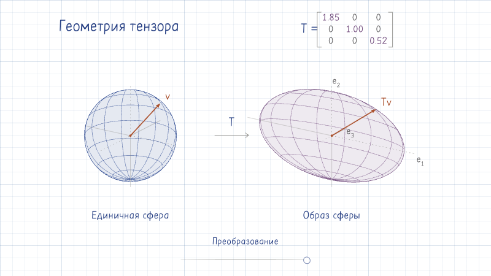
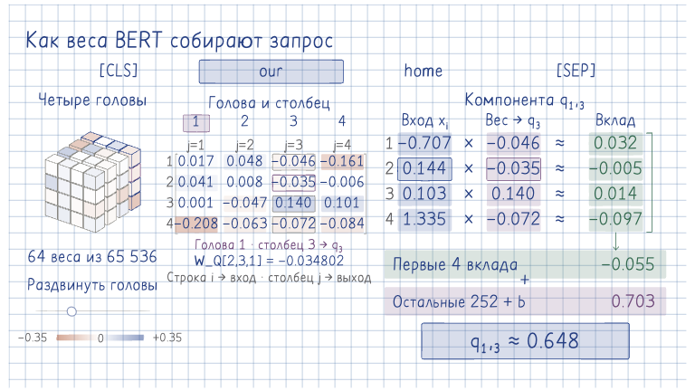

# Геометрия и проекция BERT: устройство примеров

Справка для переиспользования модели, геометрии и обновлений JavaScript/SVG.
Визуальный образец выбирай из [SKILL.md](../SKILL.md).

## Геометрическое преобразование



[SVG](../../examples/geometric-tensor/geometric-tensor.svg) ·
[Генератор](../../examples/geometric-tensor/build.mjs) ·
[Браузерный просмотр](../../examples/geometric-tensor/index.html)

Сфера становится эллипсоидом при `T = diag(1 + 0.85 t, 1, 1 - 0.48 t)`.
Показан образ `T v`, не поверхность уровня `v^T T v = 1`. Это конкретный
симметричный положительно определённый тензор второго порядка в главном базисе,
а не универсальная форма любого тензора. Ползунок действительно меняет `T`;
общая камера и масштаб позволяют сравнить вход и результат.

Вращение обновляет существующие SVG-узлы; устойчивое начало точного контура эллипса устраняет мерцание при совпадающих полуосях.

Сборка из каталога примера: `node build.mjs`.

## Постоянные параметры и переменные активации



[SVG](../../examples/parameter-cube/tensor-cube.svg) ·
[Генератор](../../examples/parameter-cube/cube.mjs) ·
[Живой интерфейс](../../examples/parameter-cube/cube.html) ·
[Вычислитель](../../examples/parameter-cube/projection.py)

```text
text -> embeddings + layers 1..3 -> x -> x W_Q,h + b_h -> q_h
                                           ^
                                    fixed parameters
```

Куб показывает `W_Q[i,j,h]` четвёртого слоя BERT-mini: первые четыре входные
и четыре выходные компоненты всех четырёх голов. Полная форма в этой записи
`256 x 64 x 4`; видны 64 коэффициента из 65536. `x` — внутреннее представление
токена после третьего слоя, а не исходный текст или его начальный embedding.
Показанные компоненты `q` получены полной проекцией всех 256 компонент с bias,
не умножением на видимый фрагмент. Коэффициенты могут быть отрицательными и
не являются вероятностями внимания.

Связи данных и обновлений:

- Текст меняет только токены и векторы. Параметры при inference неизменны;
  куб, цветовая шкала, камера и выбранная ячейка не пересоздаются.
- Куб, четыре матрицы и точная запись коэффициента имеют один источник данных.
  Выбор `i,j,h` выделяет соответствующие компоненты `x_i` и `q_h,j`.
  Контур токена имеет `pointer-events: all`, поэтому вся его площадь нажимается и при `fill: none`; после смены выделения проверяй центр и края каждого токена.
  Матрицы расположены в две колонки, на узком экране — в одну; полные числа
  разделены зазорами, заливки приглушены, фон использует общую тетрадную сетку.
- Прозрачное отражение раскрывает внутреннюю ячейку. Это второй вид тех же
  параметров, не результат преобразования; он плотный и вращается общей камерой.
- Геометрия обновляет атрибуты устойчивых узлов и порядок глубины. Кадр
  запрашивается только при изменении; в покое нет цикла перерисовки.

### Воспроизведение

Генераторы находятся рядом с SVG; после изменения пересобери артефакт и его превью.
Оба генератора используют `@visual-storytelling/core/controls` для нативного ползунка; контуры BERT и окончания его цветовой шкалы берутся из `SketchInk` (`src/ink/marks.ts`), а `../tools/svg_style.py` встраивает общие `ink.css`, `range.css` и шрифты.
Ползунком управляет браузер, обработчик `input` меняет только предметный параметр; после изменения `viewBox` вызывается `fitSvgControls`, сохраняющий экранный размер управления.
Превью интерактивных SVG снимай в браузере: статические SVG-рендереры не отображают HTML-поля в `foreignObject`.
`node cube.mjs` пересобирает SVG из включённого `projection.json`; модель для
этого не нужна. Оба SVG содержат готовый статический кадр и интерактивный код.
Для вращения открывай SVG как документ или через HTML `<object>`, не ``:
в режиме изображения скрипты SVG не исполняются.

Сначала собери страницы командой `npm run build` из корня библиотеки; сервер модели отдаёт `site/parameter-cube`. Только для пересчёта нового текста нужна модель. Из каталога `parameter-cube`
создай окружение и один раз загрузи закреплённую ревизию:

```sh
uv venv --python 3.12 .venv
uv pip install --python .venv/bin/python -r requirements.txt
.venv/bin/python - <<'PY'
from huggingface_hub import hf_hub_download
for name in ("config.json", "vocab.txt", "pytorch_model.bin"):
    hf_hub_download("prajjwal1/bert-mini", name,
        revision="5e123abc2480f0c4b4cac186d3b3f09299c258fc")
PY
.venv/bin/python projection.py
```

Открой `http://127.0.0.1:8067/cube.html`. После загрузки весов вычисления
локальные и офлайн; `.venv` и веса не входят в образец навыка. На macOS
`serve.command` запускает уже подготовленное окружение. Лимит 12 WordPiece
токенов, включая `[CLS]` и `[SEP]`, относится к читаемости этого примера,
не к предельной длине контекста BERT.

Снимок обновляется командой `.venv/bin/python projection.py --snapshot`, затем
`node cube.mjs` и сборкой галереи. Проверка `.venv/bin/python check_projection.py` сопоставляет
выход настоящего слоя с `x @ weight.T + bias`, проверяет выбранный фрагмент и
неизменность весов между фразами. После визуальных правок проверь рендер и
живое действие, а не только этот численный тест.

HTML владеет нативным вводом и запросами, Python — реальным вычислением,
SVG — сценой и выбором. При наборе обновляется только изменившаяся область;
отмена запроса и номер версии не дают запоздалому ответу заменить новый.
Ошибка остаётся рядом с полем, старые векторы визуально отделены от актуальных.
