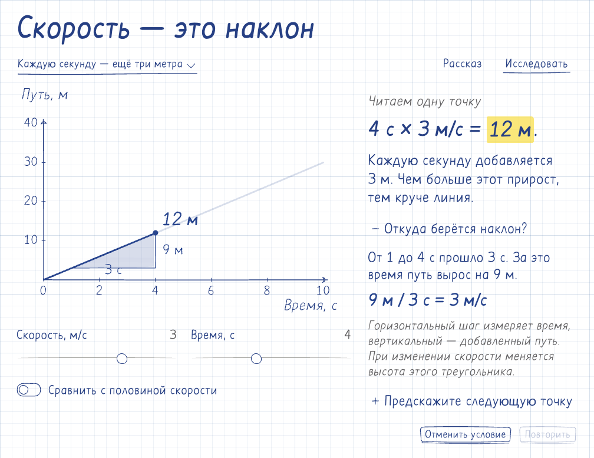

# Наглядные объяснения

Начни с вопроса зрителя и действия, которое раскрывает механизм. Сохраняй узнаваемый стиль предмета: рисованное объяснение для обучения, настоящий облик интерфейса для продуктовой инструкции. Показывай происхождение числа, преобразование или причинную связь. Голос опционален; объяснение должно быть понятным и без него.

## Учебный рисунок

До компоновки назови, что зритель замечает первым, какую связь прослеживает и какой вывод получает. Размер, цвет и свободное место следуют этому порядку. Первый экран сохраняет читаемое целое; подробность открывается рядом с предметом.

Перед новой учебной композицией открой [этот кадр](assets/explanation-reference.png) через `view_image`. Это работающий `graph-lab`: точка, измеренный путь, треугольник наклона и проверка прогноза используют одну модель. Переноси иерархию письма, зазоры, плотность чернил и связь пояснения с рисунком. Форма определяется темой: [общая композиция](../../docs/explanations.md) подтверждена также схемой `connected-diagram` и уроком `area-lesson`.

`explanationLayout` размещает рисунок, связанные параметры и пояснение, перестраивая их на узком экране без уменьшения текста. `disclosure` раскрывает устройство, `predictionPrompt` ведёт предположение и проверку. Действия проходят через `shell.input`, рисунок и обратная связь выводятся из модели. В видео с постоянной композицией можно явно выбрать `frame: {width: 1280, height: 720, scope: 'scene'}`; интерактивный подробный лист сохраняет свободный поток.

Плотные чернила несут форму и текст; прозрачный маркер выделяет короткую мысль, деликатная штриховка — поверхность или часть. Цвет роли связывает предмет, формулу и действие. Контур сохраняет форму при перемотке. `handwriting: "heading" | "body" | "note"` у `lettering` и `paragraph` различает крупную мысль, пояснение и пометку; кириллица, цифры и математика используют то же перо при появлении и в готовом тексте. Проверь настоящую длинную фразу.

Лист прозрачен в обеих темах; спокойная сетка лежит поверх фона приложения. Подписи находятся у объектов, стрелки показывают направление и причину, скобки — объединение. `plot.interval` связывает приросты с двумя точками данных. Для предметных схем `node`, `pen`, `vector` и `svgButton` дают общие рисунок, нажатие и фокус. Подробности материалов — в [оформлении](references/motion.md#оформление).

Рассказ развивается непосредственно в рисунке: локальная пометка объясняет видимое действие и его причину. Голос и субтитры подключаются по задаче; тихое объяснение остаётся полным.

## Работа в Codex

`story_help` показывает единый каталог: подходящая задача, видимое действие, возможности, эталонный кадр, исходник и точки правки `editing`. Выбери форму по запросу: иллюстрация, схема, график, опыт, математический разбор, урок или постановка. `story_open` открывает пример или сохранённую работу в MCP App. `story_create(example)` сразу возвращает редактируемые исходники, точку входа, закреплённый runtime и рабочую ревизию; сборка продолжается заданием. Выбери подходящую основу по содержанию, затем меняй её исходники.

Контекст текущего кадра прикрепляется автоматически одним обновляемым снимком. Обычное обсуждение остаётся в чате. Используй его `sessionId` и ревизии; при устаревшем состоянии или необходимости подробностей вызови `story_inspect`. Полная временная шкала и геометрия нужны только для конкретного вопроса. Не пересказывай технические IDs пользователю.

`story_find` находит cue, главу или предмет; учитывай тип результата при управлении. `story_control` меняет существующую сцену; простая пауза не требует предварительного inspect. Перемотка и исследование сохраняют исходники. Ручной ввод пользователя имеет приоритет. Для дополнительного объяснения используй `story_navigate`: оно откроется в той же панели с возвратом к уроку.

Для авторской правки прочитай проект и нужный файл через `story_inspect`, затем вызови `story_edit` с рабочей `sourceRevision` и новым `requestId`. Одна правка — один шаг отмены; подготовка запускается автоматически. Watcher подхватывает обычные файловые правки открытого проекта. Точный API узнавай пакетно через `story_help(queries, projectId)`; `query` в том же вызове находит подходящую основу из закреплённой зависимости — справка доступна до сборки. `story_inspect(jobId, waitMs)` ждёт изменение задания до 15 секунд. Объедини связанные файлы в одну авторскую транзакцию; новые правки заменяют устаревшую подготовку. Старый проект сохраняет свою библиотеку; обновляй её только через явный `story_migrate`, с возможностью undo.

`story_voice` проверяет нейросетевой Higgs и включает/меняет синтез; mute лишь меняет слышимость текущей дорожки. Для озвучки используй Higgs по умолчанию. Системные голоса macOS (включая Milena) допустимы только по явной просьбе пользователя; отсутствие Higgs или желание ускорить работу не меняет выбор. До подготовки покажи объём и требования из `story_voice`; `enabled: true` запускает общую очередь подготовки Python, моделей, речи и разметки. Отмена сохраняет проверенные части для повтора. Правка реплики сохраняет cue IDs и переиспользует неизменённые фрагменты. Тихое объяснение остаётся полноценным.

`story_review` проверяет выбранный вход и возвращает job. В `target` явно передай показанную сборку `{kind:"build",projectId,buildRevision}` либо рабочие исходники `{kind:"working",projectId,sourceRevision}`. Выбери cue/интервал для состояний сцены или авторский `scenario` JSON для реального взаимодействия. Получи отчёт и кадры через `story_inspect(jobId)`; команда `inspect` из результата читает нужный эпизод или объект без повторной записи.

`story_produce` принимает тот же `target` и выпускает HTML, PNG, SVG поддерживающей сцены, видео, субтитры или исходный архив. Для текущих условий передай `sessionId`, build target и `options.conditions:"current"` (HTML/PNG/SVG). Для MP4 выбери `options.video:{kind:"story"}` или `{kind:"interval",from,to}`. Retry сохраняет выбранный вход. Проверяй фактический результат через `story_inspect(jobId)`; `story_cancel` останавливает подготовку, `story_retry` продолжает проверенные этапы. Инструменты видео готовятся автоматически. Рабочие файлы сохраняются вне кэша плагина; пользовательские значения по умолчанию доступны через `story_preferences`.

## Авторство и проверка

Исходники, библиотека и CLI находятся в одном комплекте. Из каталога этого навыка CLI запускается как `node ../../tools/scene.mjs`; у самостоятельного проекта после установки зависимости доступен `npx visual-story`.

Состав комплекта проверяй через `story_help` либо `examples --json`, доступные
импорты — через `api`. Каталог общий для MCP, CLI и галереи; персонажи и подробные
уроки входят в поставку. Higgs готовится лениво через `story_voice`. Если системный
Node отсутствует, используй поставляемый `../../runtime/node` вместо `node`.

- Для выбора представления и сложного авторства прочитай [приёмы объяснения](references/authoring-guide.md) и один подходящий исходник из каталога.
- Для рассказа и ручного исследования — [SceneShell и общий маршрут](references/scene-template.md).
- Для морфинга — [MathMorph и InkMorph](../../docs/morphing.md); для рассказа из преобразований — [MorphStory](../../docs/morph-stories.md).
- Для тензоров, срезов и происхождения результата — [единая модель данных](../../docs/tensors.md), основы `tensor-slices` и `math-workbench`.
- Для подробного урока — [общий документ](../../docs/lessons.md), основа `area-lesson`: предположение → действие → объяснение результата.
- Для персонажей — [постановка](../../docs/characters.md), `character-lesson` или `tesla-circuit`; исходные glTF и SVG редактируются свободно.
- Для SVG/графика — [данные и публикация](references/data-plots.md); для вложенной модели — [камера и навигация](references/nested-explorer.md).
- Для разрешённой локальной озвучки — [сценарий и голос](references/narration.md). Доступность провайдера и его права проверяются отдельно от голоса Codex.
- Для проверки движения — [наблюдение и кадры](references/motion.md#проверка).

Библиотека владеет плеером, камерой, геометрией, подписями и синхронизацией. Задавай предметную модель и смысловые метки; не создавай для каждой сцены собственные часы или копию общих контролов. Общую ошибку исправляй у её владельца.

Проверь затронутые моменты на целевой поверхности: предмет действительно меняется, подпись остаётся связанной с ним, быстрый ввод предсказуем, кадр читается. Открой общий кадр учебной сцены и сопоставь с эталоном выше: весь рисунок, включая управление, должен выглядеть как аккуратный пример в тетради. Для нового оформления проверь узкую ширину, обе темы и клавиатуру. Передавай редактируемый результат и проверенные готовые файлы.
