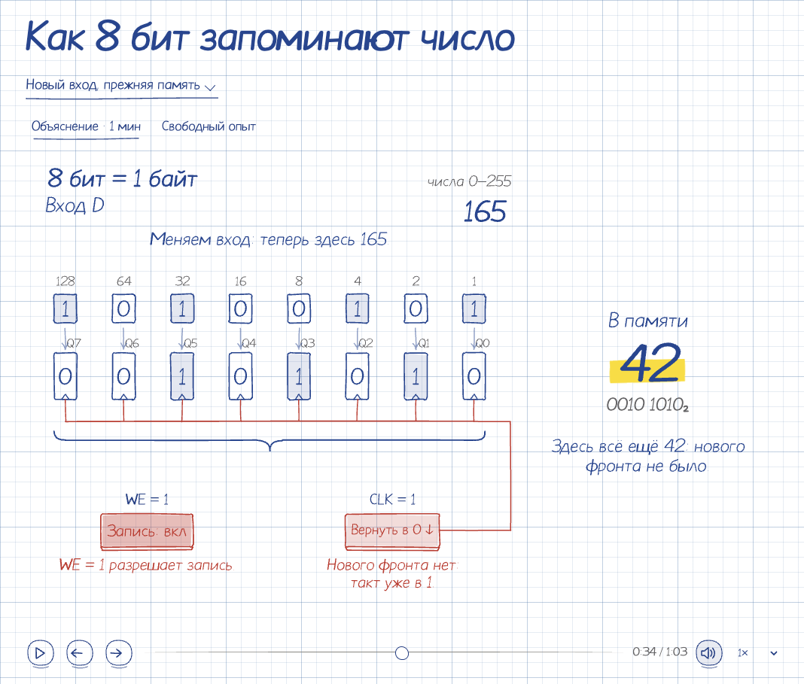

# Наглядные объяснения

Начни с вопроса зрителя и действия, которое раскрывает механизм. Сохраняй узнаваемый стиль предмета: рисованное объяснение для обучения, настоящий облик интерфейса для продуктовой инструкции. Показывай происхождение числа, преобразование или причинную связь. Голос опционален; объяснение должно быть понятным и без него.

## Учебный рисунок

Учебная сцена выглядит как аккуратно нарисованный пример в тетради: предметы, связи и короткие подписи лежат на одном листе. Контуры сохраняют небольшую устойчивую неровность, цвет напоминает прозрачный маркер, управление продолжает рисунок. Композицию определяет механизм: например, у памяти видны ячейки, провода и общий такт. Каждая рамка обозначает предмет или смысловую группу; её форма следует содержанию.

Перед новой учебной композицией открой [этот кадр](assets/notebook-reference.png) через `view_image`: это превью `memory-register`. Переноси плотность чернил, иерархию письма, зазоры и цельность рисунка; подробности — в [оформлении](references/motion.md#оформление).

Лист прозрачен в обеих темах: фон предоставляет приложение, на нём рисуется сетка. Чернила следуют светлой или тёмной теме. Основа оформления — тонкая голубая сетка с усилением через пять клеток, плотные синие чернила, крупный заголовок, наклонные примечания и редкие красные или жёлтые акценты. `handwriting: "heading" | "body" | "note"` у `lettering` и `paragraph` задаёт перо и для готового текста, и для его появления. Разница толщины и размера помогает читать композицию.

Рассказ развивается прямо в рисунке: короткое пояснение появляется возле изменяющегося предмета на соответствующих словах озвучки и объясняет действие или его причину. Связанные факты могут оставаться одновременно: у входа — новое число, у памяти — прежнее и причина сохранения. Субтитры служат дополнительной расшифровкой; самостоятельное повествование сцены создают эти локальные, меняющиеся пометки.

Учебный лист по умолчанию целый: сетка `SceneShell` проходит под заголовком, рисунком, пояснениями и управлением. Плеер остаётся внизу листа; включённые субтитры — непосредственно над ним. У вложенного `surface` задай `grid: false`; измерительная сетка в координатах камеры — [отдельный случай](references/scene-template.md#один-путь-от-времени-к-рисунку).

Для интерактивной учебной схемы начни с `memory-register`: `node` ведёт ячейку с числом, `pen` и `vector` — линии и стрелки, `lettering` — подписи. `svgButton` добавляет область нажатия и клавиатуру самому предмету; `inkButton` рисует самостоятельную кнопку команды или переключения с видимыми состояниями. При конфликте собственного CSS с общим контролом убери дублирующее оформление и сохрани библиотечные контур, состояния и фокус.

## Работа в Codex

`story_help` показывает доступные основы и проекты установленного комплекта. `story_open` открывает пример или сохранённую работу в MCP App. `story_create` создаёт редактируемый проект и возвращает его пути, IDs и задание подготовки. Выбери подходящую основу по содержанию, затем меняй её исходники.

Контекст текущего кадра прикрепляется автоматически одним обновляемым снимком. Обычное обсуждение остаётся в чате. Используй его `sessionId` и ревизии; при устаревшем состоянии или необходимости подробностей вызови `story_inspect`. Полная временная шкала и геометрия нужны только для конкретного вопроса. Не пересказывай технические IDs пользователю.

`story_find` находит cue, главу или предмет; учитывай тип результата при управлении. `story_control` меняет существующую сцену; простая пауза не требует предварительного inspect. Перемотка и исследование сохраняют исходники. Ручной ввод пользователя имеет приоритет. Для дополнительного объяснения используй `story_navigate`: оно откроется в той же панели с возвратом к уроку.

Для авторской правки прочитай проект и нужный файл через `story_inspect`, затем вызови `story_edit` с рабочей `sourceRevision` и новым `requestId`. Одна правка — один шаг отмены; подготовка запускается автоматически. Watcher подхватывает обычные файловые правки открытого проекта. Точный API узнавай через `story_help(query, projectId)` из закреплённой зависимости. Старый проект сохраняет свою библиотеку; обновляй её только через явный `story_migrate`, с возможностью undo.

`story_voice` проверяет нейросетевой Higgs и включает/меняет синтез; mute лишь меняет слышимость текущей дорожки. Для озвучки используй Higgs по умолчанию. Системные голоса macOS (включая Milena) допустимы только по явной просьбе пользователя; отсутствие Higgs или желание ускорить работу не меняет выбор. При недоступности Higgs сообщи конкретную причину и сохрани сценарий. Правка реплики сохраняет cue IDs и переиспользует неизменённые фрагменты. Тихое объяснение остаётся полноценным.

`story_review` проверяет закреплённую ревизию проекта и возвращает job. Выбери cue/интервал для состояний сцены или авторский `scenario` JSON для реального взаимодействия. Получи отчёт и кадры через `story_inspect(jobId)`; команда `inspect` из результата читает нужный эпизод или объект без повторной записи.

`story_produce` выпускает HTML, видео, субтитры или исходный архив. Проверяй фактический результат через `story_inspect(jobId)`; `story_cancel` останавливает подготовку, `story_retry` продолжает проверенные этапы. Инструменты видео готовятся автоматически. Рабочие файлы сохраняются вне кэша плагина; пользовательские значения по умолчанию доступны через `story_preferences`.

## Авторство и проверка

Исходники, библиотека и CLI находятся в одном комплекте. Из каталога этого навыка CLI запускается как `node ../../tools/scene.mjs`; у самостоятельного проекта после установки зависимости доступен `npx visual-story`.

Состав комплекта проверяй через `story_help` либо `examples --json`, доступные импорты — через `api`. Выбирай основу из этого ответа: плагин поставляет SVG/3D и морфинг, а `characters` и `book` относятся к полной библиотеке. Higgs подключается через отдельно установленный локальный `sketch-audio`; модели в плагин не входят. В плагине озвучкой владеет `story_voice`. Если системный Node отсутствует, используй поставляемый `../../runtime/node` вместо `node`.

- Для выбора представления и сложного авторства прочитай [приёмы объяснения](references/authoring-guide.md) и один подходящий исходник из каталога.
- Для рассказа и ручного исследования — [SceneShell и общий маршрут](references/scene-template.md).
- Для морфинга — [MathMorph и InkMorph](../../docs/morphing.md); для рассказа из преобразований — [MorphStory](../../docs/morph-stories.md).
- Для тензоров, срезов и происхождения результата — [единая модель данных](../../docs/tensors.md), основы `tensor-slices` и `math-workbench`.
- Для SVG/графика — [данные и публикация](references/data-plots.md); для вложенной модели — [камера и навигация](references/nested-explorer.md).
- Для разрешённой локальной озвучки — [сценарий и голос](references/narration.md). Доступность провайдера и его права проверяются отдельно от голоса Codex.
- Для проверки движения — [наблюдение и кадры](references/motion.md#проверка).

Библиотека владеет плеером, камерой, геометрией, подписями и синхронизацией. Задавай предметную модель и смысловые метки; не создавай для каждой сцены собственные часы или копию общих контролов. Общую ошибку исправляй у её владельца.

Проверь затронутые моменты на целевой поверхности: предмет действительно меняется, подпись остаётся связанной с ним, быстрый ввод предсказуем, кадр читается. Открой общий кадр учебной сцены и сопоставь с эталоном выше: весь рисунок, включая управление, должен выглядеть как аккуратный пример в тетради. Для нового оформления проверь узкую ширину, обе темы и клавиатуру. Передавай редактируемый результат и проверенные готовые файлы.
